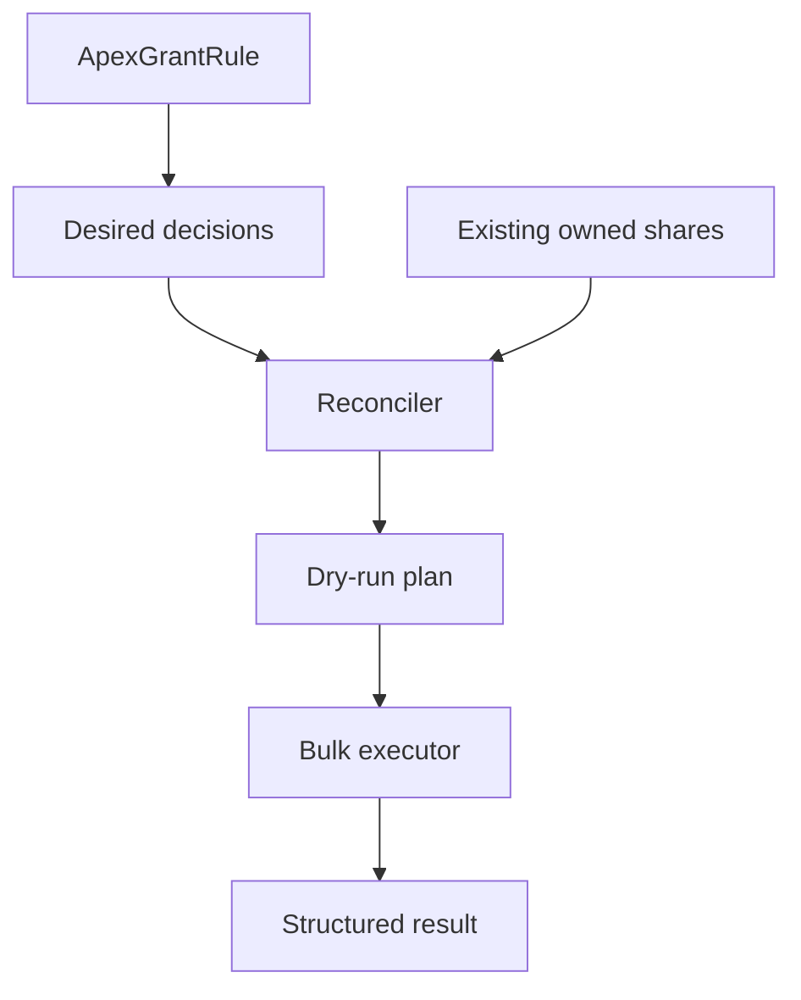

# ApexGrant Framework

**Deterministic, metadata-aware Apex managed sharing for Salesforce.**

ApexGrant is a lightweight, standalone learning and reference framework for calculating, applying and reconciling programmatic record access.

> Access must be intentional, explainable and reversible.

## Status

ApexGrant is at the architectural-foundation stage. The repository currently defines its boundaries, decision model, contribution rules and initial Apex contracts. It does not yet perform share-object DML.

The first supported slice will be:

- custom objects;
- users and public groups as recipients;
- `Read` and `Edit` access;
- framework-owned Apex Sharing Reasons;
- targeted recalculation;
- full reconciliation;
- dry-run planning;
- bulk-safe partial DML;
- clear audit results.

## Why ApexGrant?

Salesforce sharing is produced by several mechanisms: ownership, role hierarchy, sharing rules, teams, territories, manual sharing and Apex managed sharing. ApexGrant does not replace the Salesforce sharing model. It provides a disciplined application layer for one specific need:

> Calculate the access an application intends to own, compare it with the access it currently owns, and reconcile the difference without touching shares owned by another mechanism.

The core equation is:

```text
Desired framework-owned shares - existing framework-owned shares = shares to create
Existing framework-owned shares - desired framework-owned shares = shares to remove
```

Running the same reconciliation twice should not create duplicates or remove unrelated access.

## Portfolio family

| Project | Responsibility |
|---|---|
| [ApexRail](https://github.com/thegeenana/apexrail-trigger-framework) | Deterministic trigger orchestration |
| [ApexSignal](https://github.com/thegeenana/apexsignal-logging-framework) | Structured logging and operational evidence |
| [ApexConvoy](https://github.com/thegeenana/apexconvoy-batch-framework) | Reliable asynchronous workload orchestration |
| **ApexGrant** | Declarative access decisions and sharing reconciliation |

ApexGrant remains independently deployable. Integrations with the other projects will live behind optional adapters.

## Initial programming model

Application code supplies the business rule:

```apex
public class ProjectRegionManagerRule implements ApexGrantRule {
    public List<ApexGrantDecision> evaluate(List<SObject> records) {
        List<ApexGrantDecision> decisions = new List<ApexGrantDecision>();

        for (SObject record : records) {
            Project__c project = (Project__c) record;
            if (project.Region_Manager__c != null) {
                decisions.add(new ApexGrantDecision(
                    project.Id,
                    project.Region_Manager__c,
                    ApexGrantAccessLevel.EDIT,
                    'Regional_Access__c'
                ));
            }
        }
        return decisions;
    }
}
```

ApexGrant will own the mechanics:

1. validate and normalize decisions;
2. load only shares owned by the configured Apex Sharing Reason;
3. calculate a dry-run plan;
4. insert missing shares;
5. delete obsolete framework-owned shares;
6. return structured partial-success results.

## Architecture



See:

- [Architecture](docs/ARCHITECTURE.md)
- [Roadmap](docs/ROADMAP.md)
- [Glossary](docs/GLOSSARY.md)
- [Architecture decisions](docs/adr/README.md)
- [Contributing](CONTRIBUTING.md)
- [Security](SECURITY.md)

## Non-goals for the first release

- Replacing native sharing rules
- Reimplementing role or territory hierarchy
- A general formula-expression engine
- Standard-object sharing
- Cross-org access control
- Deleting manual or system-generated shares
- Mandatory dependencies on fflib or the other Apex portfolio frameworks

## Author

Designed and maintained by **George Wiafe**.

## License

MIT — see [LICENSE](LICENSE).
