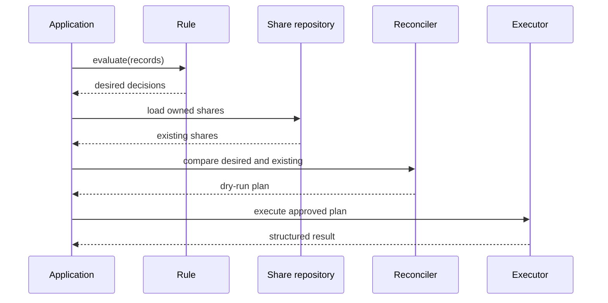

# ApexGrant architecture

## Goal

ApexGrant converts application-specific access rules into a deterministic reconciliation plan for framework-owned Apex managed shares.

## Core components

| Component | Responsibility |
|---|---|
| `ApexGrantRule` | Application-specific evaluation contract |
| `ApexGrantDecision` | Desired record, recipient, access and RowCause |
| Decision validator | Rejects unsupported or unsafe decisions |
| Share repository | Loads only framework-owned existing shares |
| Reconciler | Calculates creates, removals and unchanged shares |
| `ApexGrantPlan` | Inspectable dry-run output |
| Executor | Performs bulk partial DML |
| `ApexGrantResult` | Reports attempted, succeeded and failed operations |
| Registry | Resolves configured rules and object capabilities |
| Optional adapters | ApexRail, ApexConvoy and ApexSignal integration |

## Reconciliation lifecycle

## Identity of a share

Within one supported share object, the logical identity is expected to contain:

- parent record ID;
- user or group ID;
- access level where relevant;
- RowCause.

The exact uniqueness and update semantics must be verified for each supported Salesforce share object.

## Transaction strategies

Targeted recalculation may run in the caller's transaction. Full reconciliation belongs in an asynchronous process. ApexGrant core contains neither trigger nor batch dependencies; adapters own those lifecycles.

## Security boundary

ApexGrant manages additional access. It does not make authoritative claims about total effective access because users may receive access from ownership, hierarchy, territories, teams or other sharing rules.
